# Stage 4: Routing & Execution + UETR gpi Tracking
## Detailed Process Flow - Multi-hop Routing and Real-time Status Tracking

```mermaid
sequenceDiagram
    participant SWIFTNetwork as 🌐 SWIFT Network
    participant CorrespondentA as 🏦 Correspondent Bank A
    participant CorrespondentB as 🏦 Correspondent Bank B
    participant BeneficiaryBank as 🏛️ Beneficiary Bank
    participant gpiTracker as 📍 gpi Tracker
    participant DataLake as 🏛️ Data Lake (Gold)
    participant KafkaEvents as 📨 Kafka Events
    participant StatusService as 📊 Status Tracking Service

    Note over SWIFTNetwork, StatusService: 🔗 STAGE 4: ROUTING & EXECUTION + UETR GPI TRACKING
    Note right of StatusService: UETR enables real-time payment journey tracking

    %% Process Step 1: Network Routing with UETR
    activate SWIFTNetwork
    SWIFTNetwork->>SWIFTNetwork: Analyze Routing Path (UETR-based)
    Note right of SWIFTNetwork: UETR Routing Analysis:<br/>• Correspondent relationships<br/>• Cost optimization<br/>• Speed vs. cost trade-off<br/>• Regulatory compliance path<br/>• UETR tracking compatibility

    %% Process Step 2: First Hop - Correspondent A with UETR
    SWIFTNetwork->>CorrespondentA: Route to Correspondent Bank A (UETR included)
    activate CorrespondentA
    CorrespondentA->>CorrespondentA: Process & Validate Message (UETR preserved)
    Note right of CorrespondentA: UETR Processing Steps:<br/>• Account validation<br/>• Sanctions screening<br/>• Balance verification<br/>• Fee deduction<br/>• UETR audit trail

    %% Process Step 3: gpi Status Update #1 with UETR
    CorrespondentA->>gpiTracker: Update gpi Status (UETR: In Transit)
    activate gpiTracker
    gpiTracker->>StatusService: Real-time Status Update (UETR key)
    activate StatusService
    StatusService->>KafkaEvents: Publish Status.Updated Event (UETR indexed)
    KafkaEvents->>DataLake: Store Status Data (UETR Gold Layer)
    Note right of DataLake: ✅ UETR TARGET ACHIEVED:<br/>Real-time payment journey tracking
    deactivate StatusService

    %% Process Step 4: Second Hop - Correspondent B with UETR
    CorrespondentA->>CorrespondentB: Forward to Correspondent Bank B (UETR maintained)
    deactivate CorrespondentA
    activate CorrespondentB
    CorrespondentB->>CorrespondentB: Intermediate Processing
    Note right of CorrespondentB: Multi-hop Processing:<br/>• Currency conversion<br/>• Compliance checks<br/>• Network fee calculation<br/>• Route optimization

    %% Process Step 5: gpi Status Update #2
    CorrespondentB->>gpiTracker: Update gpi Status (Processing)
    gpiTracker->>StatusService: Status Update (Processing)
    activate StatusService
    StatusService->>KafkaEvents: Publish Status.Processing Event
    deactivate StatusService

    %% Process Step 6: Final Hop - Beneficiary Bank
    CorrespondentB->>BeneficiaryBank: Deliver to Beneficiary Bank
    deactivate CorrespondentB
    activate BeneficiaryBank
    BeneficiaryBank->>BeneficiaryBank: Credit Beneficiary Account
    Note right of BeneficiaryBank: Final Processing:<br/>• Account identification<br/>• Know Your Customer (KYC)<br/>• Account crediting<br/>• Local compliance

    %% Process Step 7: Settlement Confirmation
    BeneficiaryBank->>gpiTracker: Confirm Settlement
    BeneficiaryBank->>BeneficiaryBank: Generate pacs.002 (Confirmation)
    Note right of BeneficiaryBank: ISO 20022 Response:<br/>• pacs.002 Credit Transfer Report<br/>• Settlement confirmation<br/>• Fee details<br/>• Execution timestamp

    %% Process Step 8: Final Status Update
    gpiTracker->>StatusService: Final Status (Settled)
    activate StatusService
    StatusService->>KafkaEvents: Publish Payment.Settled Event
    KafkaEvents->>DataLake: Complete Transaction Record (Gold)
    Note right of DataLake: Gold Layer Complete:<br/>• End-to-end journey<br/>• All status updates<br/>• Performance metrics<br/>• Compliance audit trail
    deactivate StatusService
    deactivate BeneficiaryBank
    deactivate gpiTracker
    deactivate SWIFTNetwork

    Note over SWIFTNetwork, StatusService: 📊 COMPLETE TRANSACTION AUDIT TRAIL AVAILABLE

```



## Stage 4 Process Steps Summary

| Step | Process | System | Target Benefit |
|------|---------|--------|----------------|
| **4.1** | Network Routing | SWIFT Network | Route Optimization |
| **4.2** | First Hop Processing | Correspondent Bank A | Multi-hop Execution |
| **4.3** | gpi Status Update #1 | gpi Tracker + Status Service | ✅ **Real-time Traceability** |
| **4.4** | Second Hop Processing | Correspondent Bank B | Intermediate Processing |
| **4.5** | gpi Status Update #2 | gpi Tracker + Status Service | Continued Tracking |
| **4.6** | Final Hop Processing | Beneficiary Bank | Account Crediting |
| **4.7** | Settlement Confirmation | Beneficiary Bank | Settlement Assurance |
| **4.8** | Final Status Update | Status Service + Data Lake | Complete Audit Trail |

## Key Technical Components

### gpi Tracker Integration
- **Real-time Updates**: Sub-minute status updates
- **End-to-end Visibility**: Complete transaction journey
- **Status Categories**: Created, In Transit, Processing, Settled, Returned
- **Performance Metrics**: Speed, cost, and success rate tracking

### Multi-hop Routing
- **Correspondent Network**: Optimal path selection
- **Cost Optimization**: Balance speed vs. cost
- **Regulatory Compliance**: Ensure all jurisdictions support the route
- **Fallback Routes**: Alternative paths for failed transactions

### BIAN Service Domains
- **Payment Execution**: Core domain for network processing
- **Customer Case Management**: Exception handling and investigations
- **Product Deployment**: Route configuration and optimization

## Data Architecture - Gold Layer Analytics

### Real-time Status Schema
```json
{
  "eventType": "Payment.StatusUpdate",
  "uetr": "DEUTDEFFXXX20241115RND123456",
  "timestamp": "2024-01-15T10:45:30Z",
  "gpiStatus": {
    "status": "PROCESSING",
    "currentLocation": "CHASUS33",
    "processingBank": "Chase Bank New York",
    "estimatedCompletion": "2024-01-15T10:50:00Z"
  },
  "routingPath": [
    {
      "hop": 1,
      "bank": "DEUTDEFF",
      "status": "COMPLETED",
      "timestamp": "2024-01-15T10:40:15Z"
    },
    {
      "hop": 2,
      "bank": "CHASUS33",
      "status": "IN_PROGRESS",
      "timestamp": "2024-01-15T10:45:30Z"
    }
  ]
}
```

### Performance Analytics
```json
{
  "routeAnalytics": {
    "averageHops": 2.3,
    "averageProcessingTime": "4.2 minutes",
    "successRate": 99.85,
    "costEfficiency": 94.2,
    "customerSatisfactionScore": 4.7
  }
}
```

## Status Tracking Framework

### gpi Status Categories
| Status | Description | Typical Duration | Customer Impact |
|--------|-------------|------------------|-----------------|
| **Created** | Payment initiated | 0-30 seconds | Confirmation sent |
| **In Transit** | Routing through network | 30 seconds - 2 minutes | Progress update |
| **Processing** | Correspondent processing | 1-5 minutes | Real-time tracking |
| **Settled** | Funds credited | 3-10 minutes | Completion notice |
| **Returned** | Payment rejected | Variable | Investigation required |

### Real-time Updates
- **Frequency**: Every 30 seconds during processing
- **Latency**: < 10 seconds from actual status change
- **Reliability**: 99.9% update delivery rate
- **Format**: ISO 20022 camt.056 and gpi-specific formats

## Route Optimization Engine

### Factors Considered
1. **Speed**: Fastest available route
2. **Cost**: Lowest total fees
3. **Reliability**: Historical success rates
4. **Compliance**: Regulatory requirements
5. **Capacity**: Network congestion levels

### Route Selection Algorithm
```
Route Score = (Speed Weight × Speed Score) + 
              (Cost Weight × Cost Score) + 
              (Reliability Weight × Reliability Score)

Default Weights: Speed=40%, Cost=35%, Reliability=25%
```

## Exception Handling

### Retry Mechanisms
- **Network Timeout**: 3 retry attempts with exponential backoff
- **Correspondent Unavailable**: Alternative route selection
- **Invalid Account**: Return with detailed reason codes
- **Regulatory Block**: Immediate stop with compliance notification

### Investigation Triggers
- **Processing Time Exceeded**: > 15 minutes for standard payments
- **Unexpected Route Changes**: Deviation from planned path
- **Status Update Gaps**: > 5 minutes without updates
- **Customer Inquiries**: Proactive investigation initiation

## Next Stage
➡️ [Stage 5: Payment Integration](stage5-payment-integration.md) - Data integration and customer notifications